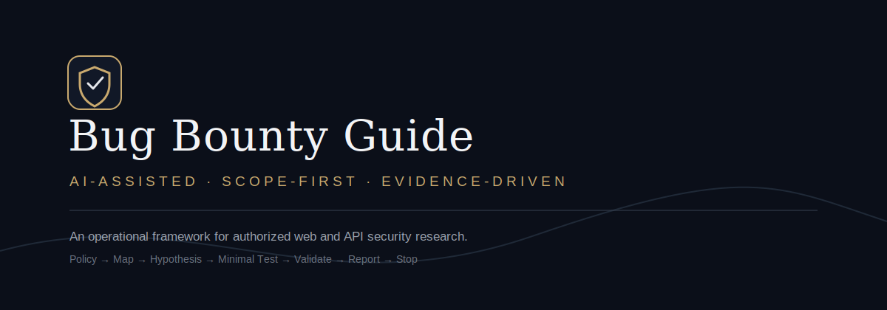
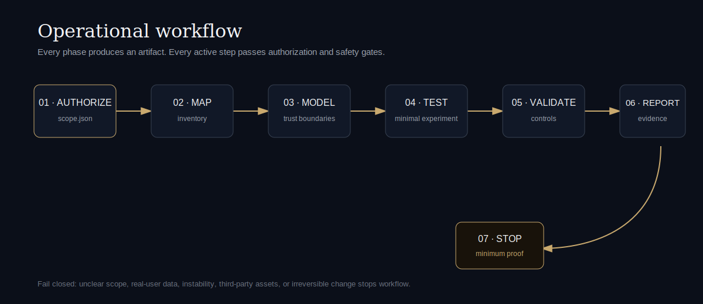

<p align="center"></p>
<p align="center"><a href="SKILL.md"><strong>AgentSkill</strong></a> · <a href="docs/workflows/openclaw-quickstart.md"><strong>Quickstart</strong></a> · <a href="docs/workflows/advanced-operating-model.md"><strong>Operating model</strong></a> · <a href="docs/07-validation.md"><strong>Validation</strong></a> · <a href="docs/08-reporting.md"><strong>Reporting</strong></a></p>
<p align="center">   </p>

## A field guide built for agents — governed by humans

**Bug Bounty Guide** turns vague “scan this target” requests into controlled, auditable research engagements. OpenClaw and compatible AI agents receive an operational contract: establish authorization, map boundaries, design minimal experiments, challenge evidence, report precisely, then stop.

> **Permission precedes capability.** A hostname is never authorization. Active testing remains blocked until explicit scope evidence is recorded and safety gate passes.

<p align="center"></p>

## What makes it different

| Principle | Operational effect |
|---|---|
| **Fail-closed authorization** | `scope_guard.py` blocks incomplete or unsafe manifests. |
| **Artifacts over improvisation** | Every phase produces reviewable output before next transition. |
| **One controlled executor** | Multi-agent teams cannot silently multiply target traffic. |
| **Falsification first** | Validator tries to disprove candidate before submission. |
| **Minimum viable proof** | Research stops when impact is safely demonstrated. |
| **Quality over volume** | Optimize validated findings, not scanner output. |

## Enterprise compliance and operations

The repository provides compliance alignment files and automated pipeline checks:

- **[Enterprise compliance mapping](docs/enterprise/compliance-mapping.md)** — Mappings for NIST SP 800-53 Rev. 5, ISO/IEC 27001:2022, and SOC 2 Type II (Trust Services Criteria).
- **[CI/CD pipeline playbook](docs/enterprise/cicd-playbook.md)** — Integration guides for automating research checks, rate limiting, and scope enforcement in testing environments.
- **[JSON Schema definition](schemas/scope-schema.json)** — Machine-readable validation rules for program definitions.
- **[CI/CD validation workflow](.github/workflows/validate.yml)** — GitHub Actions pipeline config.

## Five-minute OpenClaw start

```text
Use AI Bug Bounty Guide for program policy at <POLICY_URL>.
First extract exact scope, exclusions, restrictions, and rate limits.
Create scope.json and run scope guard.
Do not send active target traffic until gate passes.
Then produce passive inventory and ranked safe hypotheses only.
```

```bash
uv run python scripts/scope_guard.py scope.example.json
```

Full setup: **[OpenClaw quickstart](docs/workflows/openclaw-quickstart.md)**.

## Reference toolkit

- **[Glossary](docs/reference/glossary.md)** — Precise definitions for agents and humans.
- **[Cheatsheet](docs/reference/cheatsheet.md)** — Fast pre-flight and reporting checklist.
- **[Test-plan template](docs/reference/test-plan-template.md)** — Copy-ready per-hypothesis plan.
- **[Finding schema](schemas/finding-schema.json)** — Structured finding record for pipelines.
- **[Unified CLI](scripts/bbg.py)** — init, validate, score, report for engagement folders.
- **[Changelog](CHANGELOG.md)** — Version history.

### CLI quick use

`ash
python scripts/bbg.py init acme
python scripts/bbg.py validate acme
python scripts/bbg.py score engagements/acme/findings/HYP-001.json
python scripts/bbg.py report acme
``n
## Extended tooling

- **[CVSS calculator](scripts/lib/cvss_calculator.py)** — Compute CVSS v3.1 score from vector string.
- **[Time tracker](scripts/lib/time_tracker.py)** — Log time per engagement phase.
- **[Attack surface map](assets/canvas/surface-map.html)** — Visual endpoint risk heatmap (Canvas).

### CVSS calculator

`ash
python scripts/lib/cvss_calculator.py CVSS:3.1/AV:N/AC:L/PR:L/UI:N/S:U/C:H/I:N/A:N
# Score: 6.5 / Severity: Medium
``n
### Time tracking

`ash
python scripts/lib/time_tracker.py acme start recon
python scripts/lib/time_tracker.py acme stop
python scripts/lib/time_tracker.py acme summary
``n
### Unified CLI (extended)

`ash
python scripts/bbg.py list
python scripts/bbg.py dashboard
python scripts/bbg.py export acme
python scripts/bbg.py import acme extra-findings.json
``n
## macOS/iOS Visual Interface (Canvas Dashboard)

The repository features an Apple-style interactive Control Center dashboard built with OpenClaw Canvas. This interface simplifies manual scope.json manifest generation and verification with instant visual feedbacks.

To run the visual panel on your OpenClaw node:

1. Copy the visual interface to your canvas root folder:
   `ash
   python scripts/canvas_launcher.py
   `
2. Execute the present command in your OpenClaw session:
   `	ext
   canvas(action='present', url='/__openclaw__/canvas/bug_bounty_guide_dashboard.html')
   `
3. Configure your scope settings in the GUI, click **Generate**, verify safety check statuses, and click **Copy Manifest** to paste straight into your local workspace.

## Advanced tooling

- **[Progress tracker](assets/canvas/progress.html)** — Real-time engagement progress dashboard (Canvas).
- **[Evidence manager](scripts/lib/evidence_manager.py)** — Capture, hash, redact, and organize evidence.
- **[Scope discovery](scripts/lib/scope_discovery.py)** — Resolve wildcards and enumerate concrete assets.
- **[Test runner](scripts/lib/test_runner.py)** — Execute hypothesis tests with rate limiting and stop conditions.
- **[Auto-deploy](scripts/lib/auto_deploy.py)** — Sync findings to GitHub issues or cloud storage.
- **[False-positive database](docs/database/false-positives.json)** — Common false-positive patterns and controls.

### Evidence workflow

`ash
python scripts/lib/evidence_manager.py capture request-001 < response.txt
python scripts/lib/evidence_manager.py list
``n
### Test runner with rate limiting

`ash
python scripts/lib/test_runner.py engagements/acme/findings/HYP-001.json 2.0
``n
## Repository architecture

```text
BugBountyGuide/
├── SKILL.md                  # Agent entry point and mandatory gates
├── scripts/scope_guard.py    # Deterministic authorization check
├── references/               # On-demand agent operating knowledge
├── assets/                   # Engagement, report, visual templates
├── docs/workflows/           # Advanced AI operating model
├── docs/00–09                # Web/API field guide
├── checklists/               # Human review controls
└── scope.example.json        # Machine-readable manifest
```

## Operating model

1. **Authorize** — preserve policy evidence and exact boundaries.
2. **Map** — inventory only assets with explicit scope match.
3. **Model** — identify actors, objects, states, enforcement points.
4. **Test** — change one variable using minimum request budget.
5. **Validate** — run controls and eliminate alternatives.
6. **Report** — separate observation, inference, impact, remediation.
7. **Stop** — close after minimum reproducible proof.

Advanced detail: **[state machine, risk budget, confidence model, and quality metrics](docs/workflows/advanced-operating-model.md)**.

## Multi-agent orchestration

- **Coordinator** owns scope, request budget, transitions, and stop decision.
- **Scope Agent** extracts policy; never tests target.
- **Recon Agent** produces passive inventory and confidence labels.
- **Test Planner** writes bounded experiments; never self-authorizes.
- **Executor** alone sends approved traffic.
- **Validator** attacks assumptions and false positives.
- **Reporter** converts redacted evidence into concise submission.

See [agent playbook](references/agent-playbook.md) and [hypothesis ledger](docs/workflows/hypothesis-ledger.md).

## Field guide

[Rules](docs/00-rules-of-engagement.md) · [Method](docs/01-methodology.md) · [Recon](docs/02-recon.md) · [Web](docs/03-web-testing.md) · [API/GraphQL](docs/04-api-graphql.md) · [Identity](docs/05-identity.md) · [Business logic](docs/06-business-logic.md) · [Validation](docs/07-validation.md) · [Reporting](docs/08-reporting.md) · [Tooling](docs/09-tooling.md)

## Safety boundary

Stop on real-user data, credentials, instability, third-party assets, irreversible change, or unclear authorization. No denial of service, phishing, credential attacks, persistence, malware, stealth/evasion, secret harvesting, or private-network/cloud-metadata probing unless program explicitly authorizes exact action.

## Contributing

Original techniques welcome when they include scope boundary, safe test, controls, false-positive risks, and maintained references. Read [CONTRIBUTING.md](CONTRIBUTING.md).

## Attribution and license

Original work maintained by [0x4riff](https://github.com/0x4riff). Inspired by public security education including OWASP and PortSwigger Web Security Academy. Repository does not copy unlicensed contents from `KingOfBugBountyTips`.

Content licensed under [CC BY 4.0](LICENSE). Educational and authorized security research only.